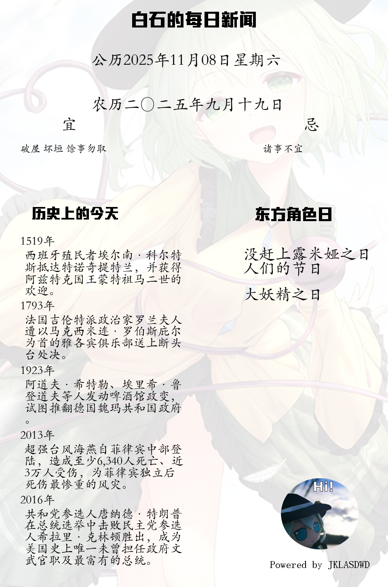

### 白石的每日新闻

- 这是什么？

  从Wikipedia上爬取每日新闻，从当前的date下获取东方角色日，利用pillow生成日报图片的一个项目，可利用Fastapi+uvicorn部署api（也可自行构建）

- 库需求？

  详见requirements.txt，没有很严格的版本要求

- 如何配置？

  参阅settings.yml

  agent_url：详见 [gh-proxy](https://github.com/hunshcn/gh-proxy).

  pic_path：模板图片路径

  font_path：文字ttf文件所在路径

- 效果展示

  

  

  

  

  